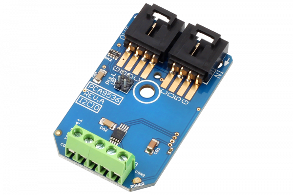

# PCA9537_I2CO4_IRFR3710
[](https://store.ncd.io/product/pca9536-digital-4-channel-input-output-i2c-mini-module/).

# PCA9537_I2CO4_IRFR3710
PCA9537_I2CO4_IRFR3710 is an 8-pin CMOS device that provides 4 bits of General Purpose parallel. .
This Device is available from www.ncd.io [SKU: APCA9537_I2CO4_IRFR3710_I2CS]
(https://store.ncd.io/product/pca9536-digital-4-channel-input-output-i2c-mini-module/)
This Sample code can be used with Raspberry Pi and Arduino.

## Python
Download and install smbus library on Raspberry pi. Steps to install smbus are provided at:
https://pypi.python.org/pypi/smbus-cffi/0.5.1
Download (or git pull) the code in pi. Run the program.

```cpp
$> python PCA9537_I2CO4_IRFR3710.py
```

## Arduino
Download and install Arduino Software (IDE) on your machine. Steps to install Arduino are provided at:

https://www.arduino.cc/en/Main/Software

Download (or git pull) the code and double click the file to run the program.
Compile and upload the code on Arduino IDE and see the output on Serial Monitor.
